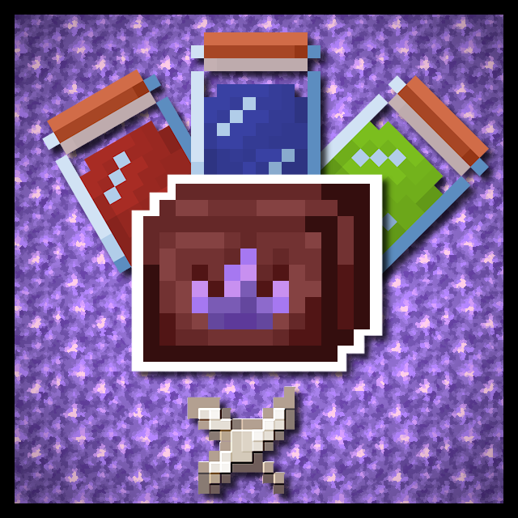
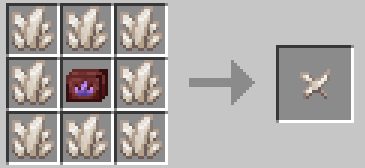
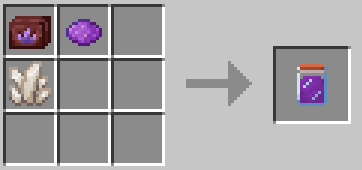
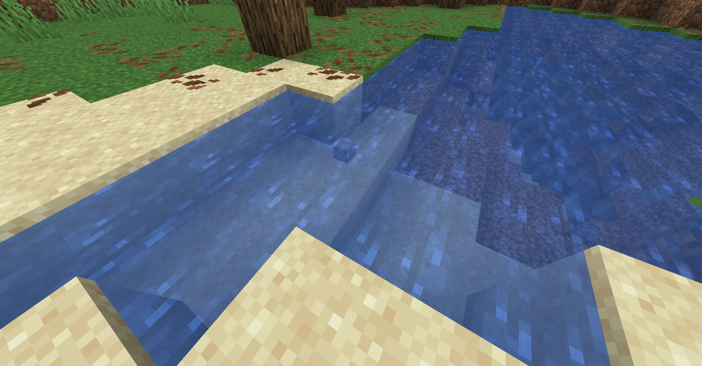
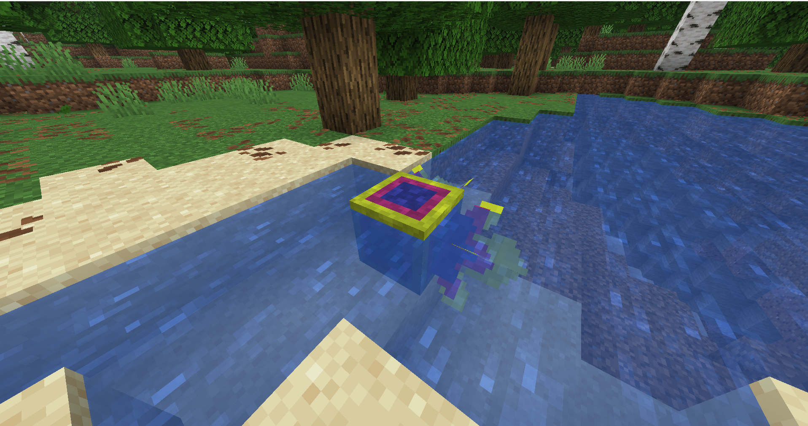
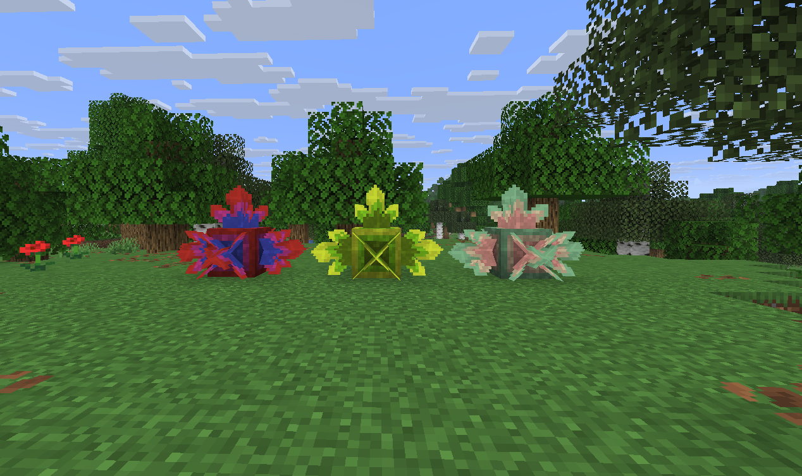

<!--suppress HtmlDeprecatedTag, XmlDeprecatedElement -->

Grow your own crystals with customizable colors and properties!

---

Grow your own crystals with customizable colors, where each crystal can have up to 3 differently colored layers, add custom properties to the crystal, such as making it glow or even turning your crystals into candies!

- Use the crystal growing toolkit to make a crystal seed (can be traded from piglins or stolen from their bastions (if you're bold enough))
- Grow the crystal seed by placing it into water and feeding it with crystalline solution
- The solution can be crafted using the toolkit, a crystal base (quartz, amethyst or diamond), one or two dyes and a powdery substance (optional)
- Each powdery substance adds its own unique effects to the crystal, find out what each of them does!
- The solution takes some time to dissolve and form the crystal, so take your time, and don't forget to hydrate the crystal when needed!
- WARNING: THE CRYSTAL CANNOT BE MOVED AFTER PLACING WITHOUT IT BEING BROKEN
- The crystal clusters formed on it, however, can be safely moved, as well as crafted into a full block

Crystal seed recipe (the toolkit is not fully consumed after crafting and can be used again)

Crystalline solution recipe example (remember, you can mix colors as well as add different powders for special properties)

A crystal seed submerged into water

A fully grown crystal seed  

These are just some of the patterns. Remember - the possibilities are endless!

---

